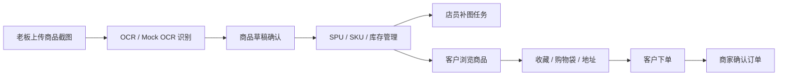

# Store Automation Listing E-commerce System

面向中小服饰商家的微信小程序 MVP。项目把“截图识别上货、商品/库存管理、店员补图、客户浏览下单、商家确认订单”串成一条可验证的闭环，用于展示 uni-app + Vue 3 + TypeScript 在小程序业务场景中的工程化落地能力。

> 说明：仓库不包含真实密钥。微信 AppID、CloudBase envId 等环境标识不是密钥，但公开使用前建议替换为自己的演示环境，并通过环境变量配置服务端凭据。

## 项目亮点

- 多角色业务闭环：老板端、店员端、客户端共用一套商品、订单、库存和图片任务流程。
- 小程序真实工程栈：uni-app、Vue 3、TypeScript、Vite、TDesign MiniProgram、Vant Weapp。
- CloudBase-ready 后端：云函数 `mallApi`/`mallHealth`、Node BFF 基线、PostgreSQL 迁移与 CloudBase 数据模型文档。
- 页面边界清晰：页面只负责渲染和交互，业务编排放在 `src/features/`，外部 IO 放在 `src/services/`。
- 可回归验证：lint、边界检查、单测、覆盖率、类型检查、后端构建、依赖审计和 mp-weixin smoke 串联为 `verify`/`verify:full`。

## 业务流程



## 核心模块

| 模块 | 说明 | 代表目录 |
| --- | --- | --- |
| 客户商城 | 商品列表、详情、收藏、购物袋、地址、我的、订单详情 | `src/pages/customer/` |
| 老板工作台 | 登录、商品管理、订单确认、权限与账号管理、首页配置 | `src/pages/owner/` |
| 店员补图 | 待补图任务和图片上传流程 | `src/pages/staff/` |
| 业务编排 | 页面 ViewModel / Facade、跨领域用例 | `src/features/` |
| 外部服务 | CloudBase、OCR、上传、鉴权、仓储适配 | `src/services/` |
| 云函数 | `mallApi`、`mallHealth` 及测试数据调用样例 | `cloudfunctions/` |
| 后端基线 | Node HTTP BFF、数据库迁移、CloudBase 数据模型验证 | `backend/` |
| 工程文档 | PRD、交付日志、架构、合同、测试策略、运维 runbook | `docs/` |

## 技术栈

- **Frontend**: uni-app, Vue 3, TypeScript, Vite
- **Mini Program UI**: TDesign MiniProgram, Vant Weapp
- **Backend / Serverless**: CloudBase cloud functions, Node.js HTTP baseline
- **Data / Persistence**: CloudBase document data model, PostgreSQL migration baseline, in-memory/mock adapters for MVP flows
- **Quality**: Vitest, vue-tsc, ESLint, architecture boundary check, coverage, pnpm audit, mp-weixin smoke

## 架构边界

```text
src/domain/        领域类型、纯规则、状态检查和业务不变量
src/features/      跨 domain/services 的用例编排、页面 ViewModel / Facade
src/services/      外部 IO 适配器、mock provider、认证、上传和仓储实现
src/pages/         小程序页面渲染、页面局部状态、用户交互和 uni API
backend/           Node BFF/API、数据库迁移、CloudBase 数据模型校验
cloudfunctions/    CloudBase 云函数入口和 mallApi 行为实现
docs/              PRD、交付日志、架构、测试策略和运维说明
```

页面层不直接写仓储，不绕过 feature/facade 合约；`domain` 不依赖 `features`、`services`、`pages` 或 `uni` API。相关约束见：

- `docs/architecture/system-overview.md`
- `docs/architecture/module-boundaries.md`
- `docs/contracts/page-facing-ui-contracts.md`
- `docs/testing/test-strategy.md`

## 本地运行

```powershell
pnpm install
pnpm.cmd run dev:mp-weixin
```

然后在微信开发者工具中导入：

```text
dist/dev/mp-weixin
```

生产构建：

```powershell
pnpm.cmd run build:mp-weixin
```

后端基线：

```powershell
pnpm.cmd run backend:test
pnpm.cmd run backend:build
$env:BACKEND_HOST = '127.0.0.1'
$env:BACKEND_PORT = '3001'
$env:NODE_ENV = 'development'
pnpm.cmd run backend:start
```

健康检查：

```powershell
Invoke-RestMethod http://127.0.0.1:3001/health
```

## 验证

常规验证：

```powershell
pnpm.cmd run verify
```

影响小程序构建或运行时代码时，运行完整验证：

```powershell
pnpm.cmd run verify:full
```

`verify` 覆盖 lint、边界检查、测试、覆盖率、类型检查、后端测试/构建、生产依赖审计和全量依赖审计。

## 展示路径

招聘方可以优先阅读这些文件理解项目质量：

- `src/pages/customer/product-list/index.vue`：客户商品列表和视图切换。
- `src/pages/customer/product-detail/index.vue`：规格选择、授权下单和订单创建入口。
- `src/pages/customer/shopping-bag/useCustomerShoppingBagPageState.ts`：客户购物袋页面状态组织。
- `src/pages/owner/products/useOwnerProductsPageState.ts`：老板端商品管理状态和操作编排。
- `src/services/cloudbase/mall-api-client.ts`：页面安全的 CloudBase API 客户端。
- `cloudfunctions/mallApi/mall-api-core.js`：云函数侧业务 action 分发和数据处理。
- `docs/architecture/module-boundaries.md`：模块边界和依赖规则。

## 当前状态

这是一个面向 MVP 验证和工程展示的项目，重点展示业务闭环、分层边界、可测试性和小程序运行链路。真实生产接入时，需要替换或确认：

- 微信小程序 AppID 与合法域名配置。
- CloudBase 环境、集合、权限、云函数部署状态。
- OCR/AI provider、对象存储、数据库和后台账号密钥。
- 真实设备验收和生产监控策略。
